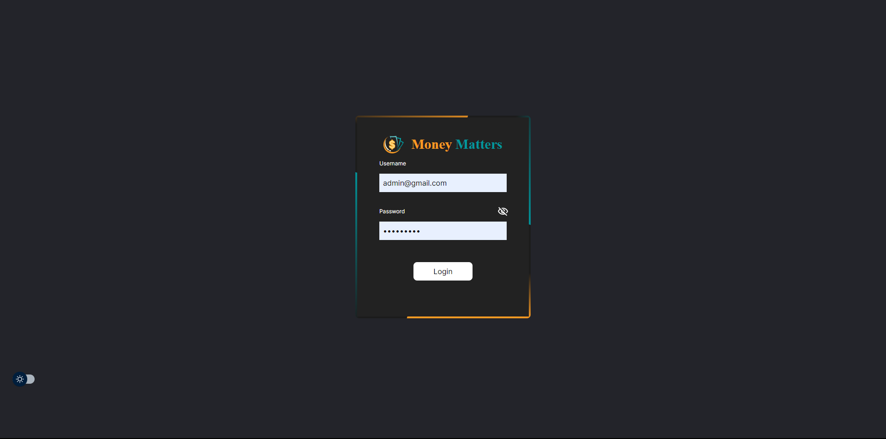
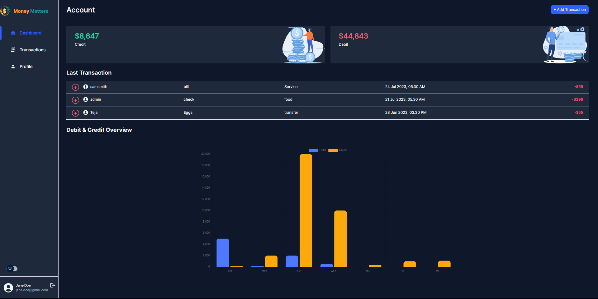
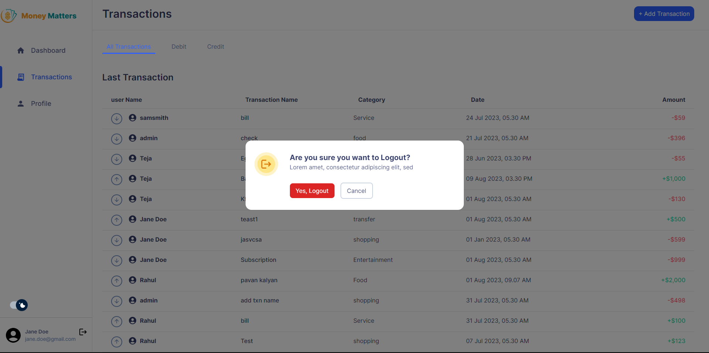

# Money Matters - Personal Transaction Management App


## Table of Contents

- [Introduction](#introduction)
- [Demo](#demo)
- [Features](#features)
- [Technologies Used](#technologies-used)
- [Installation](#installation)
- [APIs](#apis)
- [Screenshots](#screenshots)
- [Contributing](#contributing)
- [License](#license)

## Introduction

Money Matters is a Personal Transaction Management App built using Next.js, Tailwind CSS, and various APIs. It allows users to track their personal financial transactions, manage expenses, and view transaction history. The app features both light mode and dark mode to cater to users' preferences.

## Demo

You can view the live demo of the Money Matters app at [Here](https://money-matters-9hgy.vercel.app).

## Features

- User authentication with role-based access (Admin and Non-Admin users).
- Dashboard displaying total credit and total debit amounts, recent transactions, and a bar chart.
- User-specific transaction views with infinite scroll pagination.
- Add, update, and delete transactions with validation checks.
- User profile page displaying personal details.
- User prefered theme settings.

## Technologies Used

The Money Matters app is built using the following technologies:

- Next.js: A React framework for server-rendered React applications.
- Tailwind CSS: A utility-first CSS framework.
- React Hooks: For managing state and component logic.

## Installation

To run the Money Matters app locally, follow these steps:

1. Clone the repository:

```bash
git clone https://github.com/vamshi568/money-matters.git

```
2. Install the dependencies:

```bash
npm install
```
3. Start the development server:

```bash
npm run dev
```

## APIs

The Money Matters app uses various APIs to manage transactions and user data. For detailed information about the APIs and how to use them, refer to the [API Documentation](https://www.postman.com/interstellar-firefly-777826/workspace/money-matters/collection/28254623-dcd2cdfa-4af1-49f5-bd68-a7218aedc5e7?action=share&creator=28256022).

## Screenshots







## Contributing

We welcome contributions to the Money Matters app. If you find any bugs, have feature suggestions, or want to improve the code, feel free to create pull requests. Make sure to follow the coding guidelines mentioned in the project's README.